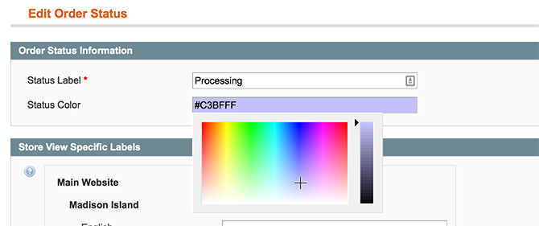
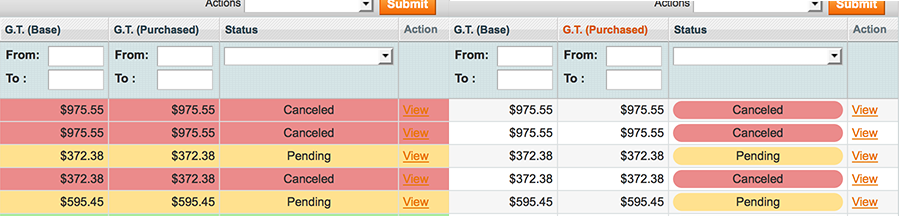

***Changing order status colors***

You can assign any color to a status from Magento Admin > System > Order Statuses. A new field called Status Color will have been added to both the Edit and New Order Status pages.

Once on Magento Admin > System > Order Statuses simply select the row of the status you could like to change click the "Status Color" Field select the color you would like to use and hit Save Status, if the save was successfull you should then see a success message "The order status has been saved." and the new color will be demonstrated in the Status Color column of the status grid.

***Changing the default Status Color***

To make it easy to see when the installation was successful we added a defualt Status Colou, if you want to change or remove that you can do so from Magento Admin > Sytem > System Configuration > TheExtensionLab > Status Colors. You should then see a Default Styles section simply update the Default Status Color in this section as needed, to have no default clear the feild and save.

***How do I hightlight the whole row rather than just the status within that row?***

If you would like to hightlight the whole row on the order grid rather than just the status there is a setting. Navigate to the Status Color settings section unser System configuration, change Grid Style > Color Whole Row to and hit save config. The next time you visit the sale order grid page the whole row should now be colored in.

